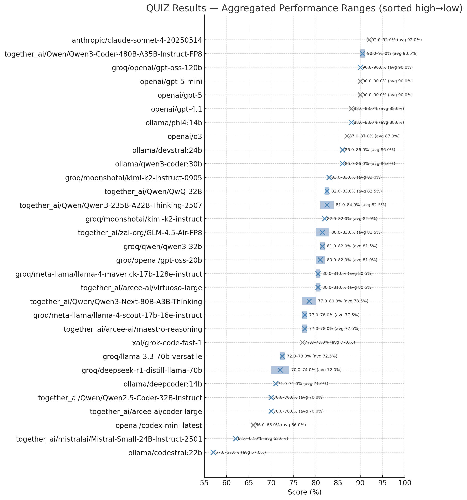
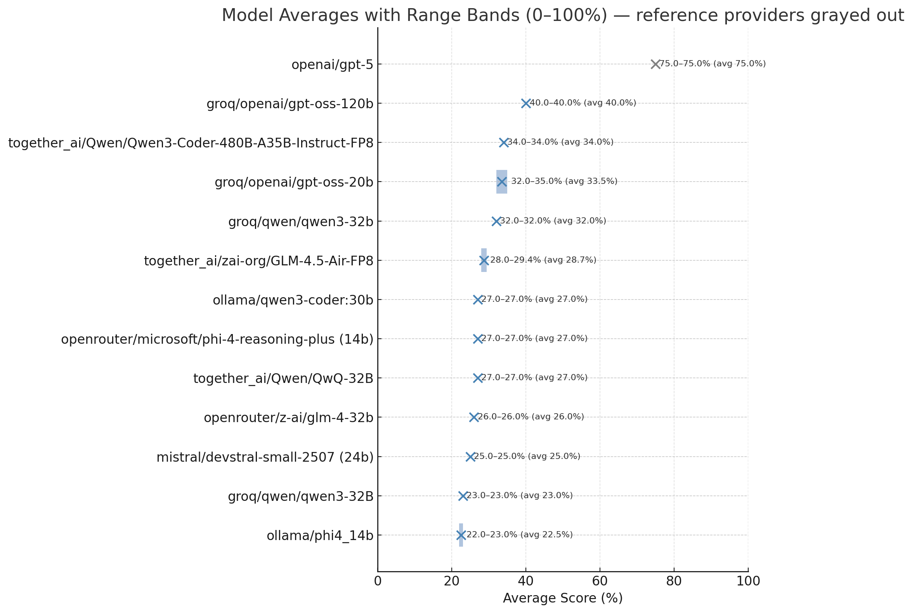

# NicheBench

NicheBench is a lightweight, extensible CLI framework for benchmarking AI models on **framework-specific tasks**. Starting with Drupal, it features LLM-as-a-Judge evaluation, configuration-driven model management, and a rich CLI for interactive reporting.

Provided by [HumanFace Tech](https://humanfacetech.com).

## ✨ Key Features

- **🎯 LLM-as-a-Judge**: All tasks scored by a second LLM with custom prompts (no regex/heuristics)
- **📊 3-Value Scoring**: Pass (>66%), Partial (33-66%), Fail (<33%) for nuanced evaluation
- **🤖 Multi-Turn Conversations**: Agentic code generation with iterative refinement
- **⚡ Parallel Execution**: Configurable parallelism with beautiful worker progress visualization
- **🛡️ Runaway Protection**: Automatic detection and handling of repetitive model responses
- **📦 Framework Packs**: Plug-and-play support for frameworks (Drupal first, others to follow)
- **⚙️ Configuration-Driven**: YAML-based configuration with profiles for different evaluation scenarios
- **🔧 Provider Agnostic**: Works with OpenAI, Groq, Anthropic, etc. via `litellm`
- **🎨 Rich CLI**: Beautiful progress bars, tables, and interactive reporting with stacked results
- **🔍 Auto-Discovery**: New frameworks and tasks discovered automatically
- **📊 Structured Results**: Detailed JSON/JSONL output for analysis and reproducibility

## 🚀 Quick Start

```bash
# Install and run
poetry install
poetry run nichebench list

# View available tasks
poetry run nichebench list drupal

# Run evaluations (uses configuration defaults)
poetry run nichebench run drupal quiz

# Run specific test cases by ID
poetry run nichebench run drupal quiz --ids="drupal_quiz_001,drupal_quiz_003"

# Run with specific models
poetry run nichebench run drupal quiz --model groq/llama-3.1-8b-instant --judge openai/gpt-4o

# Use configuration profiles
poetry run nichebench run drupal quiz --profile fast        # Groq models for speed
poetry run nichebench run drupal quiz --profile reasoning   # OpenAI o1 for complex tasks
poetry run nichebench run drupal quiz --profile anthropic   # Claude models

# Run tests
poetry run pytest
```

## ⚙️ Configuration

Copy the sample configuration and customize for your needs:

```bash
cp nichebench.sample.yml nichebench.yml
# Edit nichebench.yml with your API keys and preferred models
```

NicheBench uses a `nichebench.yml` configuration file with intelligent defaults and profile system:

```yaml
# Model Under Test (MUT) configuration
mut:
  provider: "groq"
  model: "gemma2-9b-it"
  parameters:
    temperature: 0.0
    max_tokens: 4096

# Judge model configuration
judge:
  provider: "openai"
  model: "gpt-4o"
  parameters:
    temperature: 1.0
    max_tokens: 1024

# Evaluation settings
evaluation:
  parallelism: 1        # Number of parallel workers (1 = sequential)

# Configuration profiles for different scenarios
profiles:
  fast:       # Cost-effective Groq models
    mut: {provider: "groq", model: "llama-3.1-8b-instant"}
    judge: {provider: "groq", model: "llama-3.1-70b-versatile"}

  reasoning:  # OpenAI o1 models with reasoning
    mut:
      provider: "openai"
      model: "o1-preview"
      parameters:
        reasoning_effort: "high"
        reasoning_format: "hidden"
    judge: {provider: "openai", model: "o1-mini"}
```

**Configuration Precedence**: CLI args > Environment variables > Profile > Defaults

## 📊 Results Showcase

> Latest benchmark results from September 2025

### 🧠 Drupal Quiz Performance

Test models on Drupal-specific knowledge across multiple choice questions covering APIs, best practices, and advanced concepts.



**Key Insights:**

- **GPT-4o leads** with 80% accuracy on complex Drupal knowledge
- **Strong mid-tier performance** from Llama 3.1 70B (60%) and Claude Sonnet (60%)
- **Clear performance tiers** emerge across model sizes and training approaches
- **Specialized knowledge matters** - general coding ability doesn't always translate to framework expertise

### 🔧 Drupal Code Generation Performance

Evaluate models on multi-step, production-ready Drupal module development with comprehensive criteria-based judging.



**Key Insights:**

- **GPT-4o dominates** complex code generation with 67% success rate
- **Significant gap** between top performers and smaller models
- **Code structure & best practices** prove challenging even for capable models
- **Multi-turn agentic approach** enables more sophisticated implementations than single-shot generation

> 💡 **Why This Matters**: These results demonstrate that framework-specific evaluation reveals performance patterns invisible in general coding benchmarks. NicheBench helps you choose the right model for your specific technical domain.

## 🧪 Current Status

- **✅ Drupal Framework Pack**: 2 quiz + 1 code generation task (more coming)
- **✅ Multi-Turn Code Generation**: Agentic conversations with up to 5 turns
- **✅ 3-Value Scoring System**: Pass/Partial/Fail evaluation with percentage thresholds
- **✅ Runaway Protection**: Automatic detection of repetitive/infinite loop responses
- **✅ Configuration System**: Profile-based model management with YAML configuration
- **✅ LLM Integration**: Full litellm support with parameter filtering and error handling
- **✅ Judge-driven Evaluation**: DeepEval-compatible metrics with structured JSON responses
- **✅ Rich CLI**: Interactive reporting with stacked results and average scores
- **✅ Test Coverage**: Comprehensive test suite with mocked LLM responses

## 📁 Project Structure

```text
nichebench/
├── nichebench.sample.yml       # Sample configuration file
├── results/                    # Evaluation outputs
└── src/nichebench/
    ├── cli/                    # CLI commands + Rich UI
    ├── config/                 # Configuration management
    ├── core/                   # Discovery, datamodel, loaders
    ├── providers/              # LLM client + judge adapters + conversation management
    ├── metrics/                # DeepEval-compatible metrics with 3-value scoring
    ├── frameworks/             # Framework packs
    │   └── drupal/
    │       ├── data/           # YAML test cases
    │       └── prompts/        # System prompts (MUT + Judge)
    └── utils/                  # Helpers
```

### 🔒 Private Test Data

Test data for frameworks is stored in private repositories as Git submodules to prevent it from being crawled and incorporated into AI training datasets. This preserves benchmark integrity while keeping the evaluation framework open source.

**For new users**: Clone with submodules to get test data access:

```bash
git clone --recursive git@github.com:HumanFace-Tech/nichebench.git
```

**For existing clones**: Initialize submodules:

```bash
git submodule update --init --recursive
```

> **Note**: Access to private test data repositories is granted on a collaboration basis. The framework structure and evaluation prompts remain publicly available.

## 🔧 Development

```bash
# Setup development environment
poetry install
poetry run pre-commit install

# Copy sample configuration
cp nichebench.sample.yml nichebench.yml

# Run tests
poetry run pytest

# Code quality checks
poetry run pre-commit run --all-files

# CLI development
poetry run nichebench --help
```

**Requirements**: Python 3.10+, Poetry for dependency management

## 📝 How to Author Tasks

### Test Cases (YAML)

```yaml
# frameworks/drupal/data/quiz/my_quiz.yaml
id: "drupal_quiz_006"
context: "You're building a custom module..."
question: "Which API should you use for custom entities in Drupal 11?"
choices:
  - "hook_entity_info()"
  - "EntityTypeInterface annotation"
  - "EntityInterface::create()"
  - "Custom entity plugins"
correct_choice: "B"
```

And here's an example for a code generation task.
Note that we want to have a full context: everything the model needs to know to complete the task: file-tree, file contents even, acceptance criteria, etc.

```yaml
# frameworks/drupal/data/code_generation/my_code_task.yaml
id: "drupal_code_013"
context: |
  Project: "Summit"
  Stack:
    - Drupal 11.1 (standard install)
    - PHP 8.2
  Scenario:
    - Marketing wants a short-lived promo message on the homepage.
    - Editors need to toggle the message without deploying code.
summary: Provide a configurable promo block that only renders when enabled.
prompt: |
  Create a `summit_promo` module exposing a `SummitPromoBlock` block plugin.
  The block should render a promo message pulled from `summit_promo.settings` and only
  appear when the feature is enabled. Add a ConfigFormBase settings page so editors can
  toggle the feature and update the message. Ensure the block bubbles cache tags/contexts
  for the config and respects max-age. Include an automated test that flips the config
  and asserts the block output.
judge_checklist:
  - "Block plugin class annotated with `@Block`, uses dependency injection, and returns a render array with the configured message when enabled."
  - "Settings form extends ConfigFormBase, writes to `summit_promo.settings`, and prevents saving an empty message while enabled."
  - "Typed config schema present; default config installed via `config/install` with sensible initial values."
  - "Block attaches cache metadata (config tag + user permissions) using CacheableMetadata to avoid stale output."
  - "Functional test (BrowserTestBase or Kernel plus Block plugin build) toggles the config and asserts the block text visibility."
judge_notes: |
  • Block plugins live under `Drupal\summit_promo\Plugin\Block` and extend BlockBase.
  • Inject config with `ConfigFactoryInterface` or `ImmutableConfig`, not `\Drupal::config()`.
  • Settings form should clear caches after save so block output updates immediately.
  • Tests may use `drupalPlaceBlock()` or build the block plugin manually; ensure assertions cover both enabled and disabled states.
```

### System Prompts (Python)

```python
# frameworks/drupal/prompts/QUIZ.py
QUIZ_SYSTEM_PROMPT = """You are a senior Drupal developer...
Respond with only the letter of your choice (A, B, C, D, or E)."""

# frameworks/drupal/prompts/judges/JUDGE_QUIZ.py
JUDGE_QUIZ_SYSTEM_PROMPT = """You are an expert evaluator...
Respond with JSON: {"pass": true/false, "selected": "B", "score": 1, "explanation": "..."}"""
```

## 🎯 How NicheBench Differs

- **Framework-Specific**: Focus on niche technical domains (Drupal, WordPress, etc.) vs. generic benchmarks
- **3-Value Scoring**: Pass/Partial/Fail evaluation provides nuanced performance insights
- **Multi-Turn Capable**: Supports iterative code generation with conversation management
- **Runaway Protection**: Handles model misbehavior (infinite loops, repetitive responses) gracefully
- **Judge-Centric**: Every evaluation uses LLM-as-a-Judge with custom prompts, not regex matching
- **Configuration-Driven**: Profile system eliminates CLI parameter overload
- **Modular**: Plug-and-play framework packs with auto-discovery
- **Rich UX**: Beautiful CLI with stacked results, average scores, and progress tracking

## 🤝 Contributing

1. Add new framework packs under `src/nichebench/frameworks/<name>/`
2. Create YAML test cases in `data/<category>/` directories
3. Define system prompts in `prompts/` for both MUT and judge
4. Follow the existing Drupal pack structure

## 📄 License

MIT License - see [LICENSE](LICENSE) file for details.
